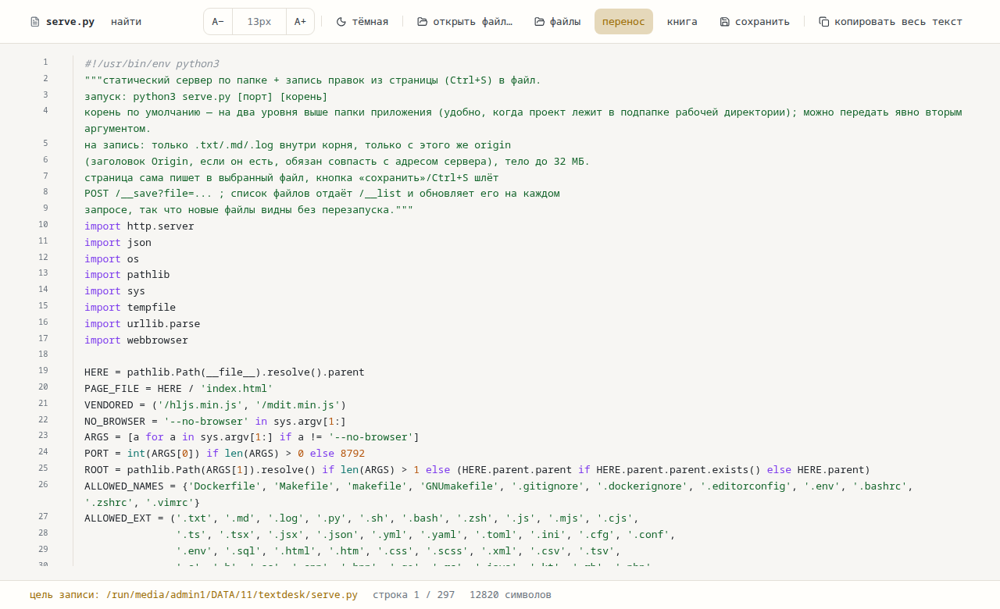
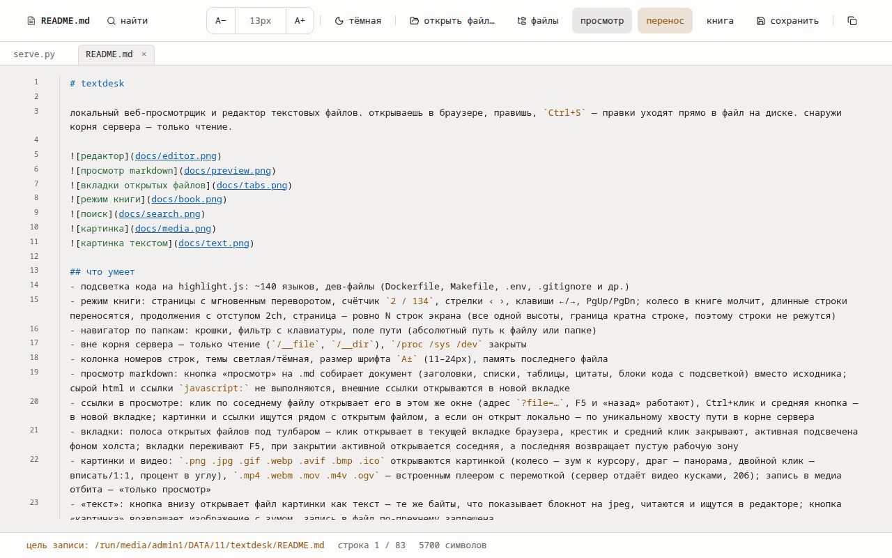
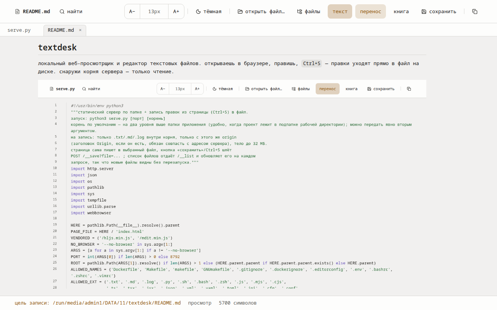
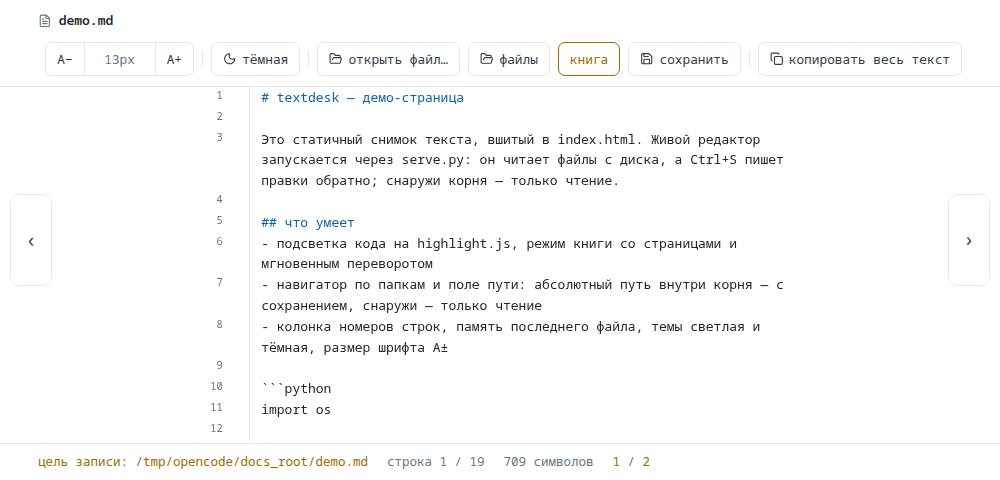
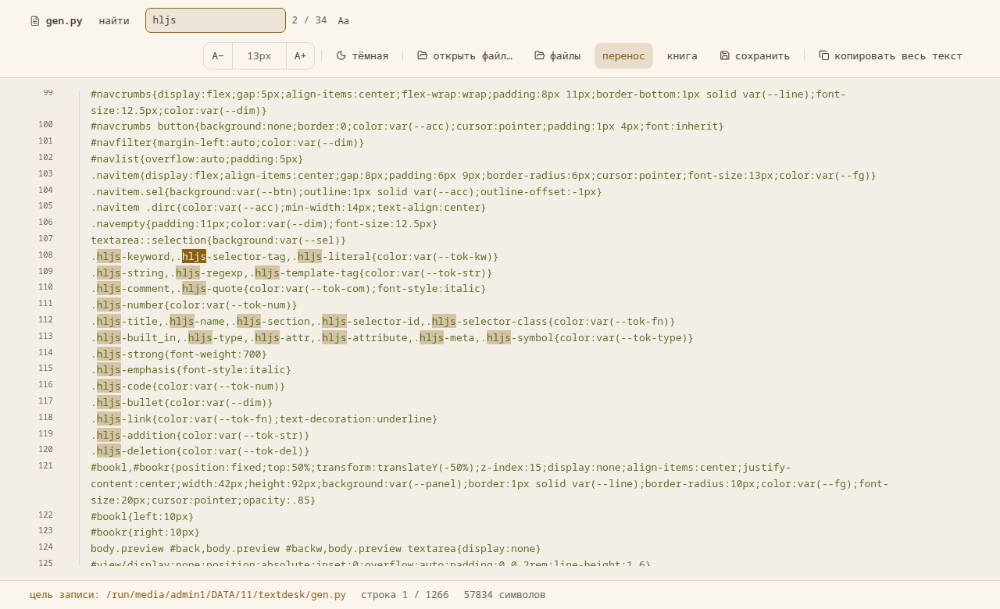
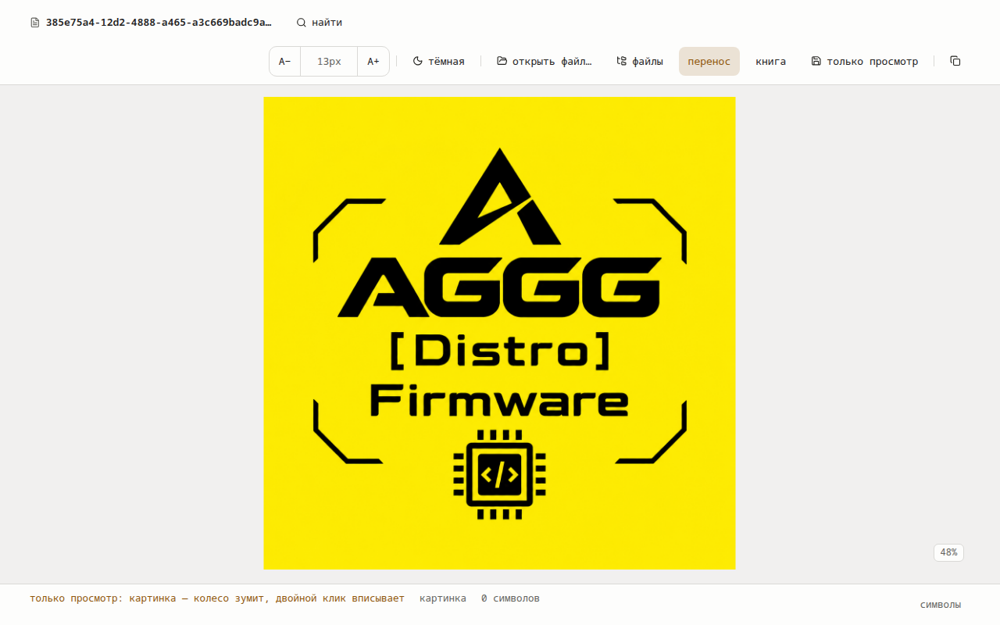
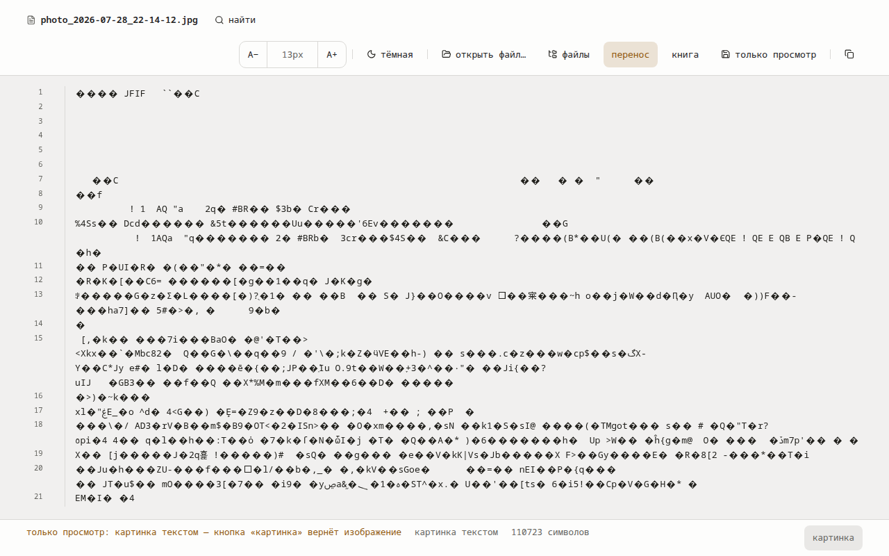

# textdesk

локальный веб-просмотрщик и редактор текстовых файлов. открываешь в браузере, правишь, `Ctrl+S` — правки уходят прямо в файл на диске. снаружи корня сервера — только чтение.









## что умеет
- подсветка кода на highlight.js: ~140 языков, дев-файлы (Dockerfile, Makefile, .env, .gitignore и др.)
- режим книги: страницы с мгновенным переворотом, счётчик `2 / 134`, стрелки ‹ ›, клавиши ←/→, PgUp/PgDn; колесо в книге молчит, длинные строки переносятся, продолжения с отступом 2ch, страница — ровно N строк экрана (все одной высоты, граница кратна строке, поэтому строки не режутся)
- навигатор по папкам: крошки, фильтр с клавиатуры, поле пути (абсолютный путь к файлу или папке)
- вне корня сервера — только чтение (`/__file`, `/__dir`), `/proc /sys /dev` закрыты
- колонка номеров строк, темы светлая/тёмная, размер шрифта `A±` (11–24px), память последнего файла
- просмотр markdown: кнопка «просмотр» на .md собирает документ (заголовки, списки, таблицы, цитаты, блоки кода с подсветкой) вместо исходника; сырой html и ссылки `javascript:` не выполняются, внешние ссылки открываются в новой вкладке
- ссылки в просмотре: клик по соседнему файлу открывает его в этом же окне (адрес `?file=…`, F5 и «назад» работают), Ctrl+клик и средняя кнопка — в новой вкладке; картинки и ссылки ищутся рядом с открытым файлом, а если он открыт локально — по уникальному хвосту пути в корне сервера
- вкладки: полоса открытых файлов под тулбаром — клик открывает в текущей вкладке браузера, крестик и средний клик закрывают, активная подсвечена фоном холста; вкладки переживают F5, при закрытии активной открывается соседняя, а последняя возвращает пустую рабочую зону
- открыть в новой вкладке браузера: Ctrl+клик или средний клик по файлу в обзоре (Ctrl+P), Ctrl+Enter в поле пути, Ctrl+клик и средний клик по ссылке в просмотре — фоновая вкладка с тем же вьювером, текущая остаётся на месте
- картинки и видео: `.png .jpg .gif .webp .avif .bmp .ico` открываются картинкой (колесо — зум к курсору, драг — панорама, двойной клик — вписать/1:1, процент в углу), `.mp4 .webm .mov .m4v .ogv` — встроенным плеером с перемоткой (сервер отдаёт видео кусками, 206); запись в медиа отбита — «только просмотр»
- «текст»: кнопка внизу открывает файл картинки как текст — те же байты, что показывает блокнот на jpeg, читаются и ищутся в редакторе; кнопка «картинка» возвращает изображение с зумом, запись в файл по-прежнему запрещена
- «открыть файл…»: в chrome/edge работает через File System Access API — файл открывается как локальный документ и `Ctrl+S` пишет прямо в него, минуя сервер (как в vscode.dev); в остальных браузерах файл читается как буфер, а цель записи подключается, только если такое имя уникально в корне сервера
- поиск: `Ctrl+F` — поиск по файлу (подсветка совпадений, текущее отдельно, счётчик `3 / 47`, `Enter`/`Shift+Enter`/`F3`, кнопка `Aa` — регистр); поле в обзоре файлов ищет по всему корню и открывает файл на нужной строке
- запись защищена: только текстовые расширения, только внутрь корня, сверка Origin, подтверждение на затирание пустым текстом

## быстрый старт

```
cd textdesk
python3 serve.py            # корень по умолчанию — на две папки выше
python3 serve.py 8792 /path/to/workspace
```

открой http://127.0.0.1:8792/ — сервер сам предложит браузер. файл выбирай кнопкой «открыть файл…» или полем пути в обзоре «файлы» (`Ctrl+P`).

статичный снимок без сервера: открой `index.html` файлом (двойной клик) или [github pages](https://aidvizhhub.github.io/textdesk/) — там только чтение и вшитый демо-текст.

## сборка страницы под свой текст

```
python3 gen.py ../notes.txt        # вшивает notes.txt в index.html как стартовый холст
```

## автозапуск (systemd user)

```
cp contrib/textdesk.service ~/.config/systemd/user/
sed -i "s|/path/to/textdesk|$(pwd)|g" ~/.config/systemd/user/textdesk.service
systemctl --user daemon-reload
systemctl --user enable --now textdesk
```

логи: `journalctl --user -u textdesk -f`, выключить: `systemctl --user disable --now textdesk`.
чтобы сервер поднимался до логина (при загрузке системы): `sudo loginctl enable-linger $USER`.
флаг `--no-browser` в юните гасит автозапуск браузера — при старте вкладки не всплывают.

## тесты

```
pip install playwright
python3 test_viewer.py             # поднимает сервер на временном корне и гоняет браузер
```

нужен системный chrome (playwright запускается с `channel='chrome'`, браузеры не качает).

## лицензия

MIT. сторонние компоненты — [THIRD_PARTY.md](THIRD_PARTY.md).

## где работает

сервер — чистый python 3 без зависимостей: linux, macos, windows. автозапуск через systemd в примере выше — только linux; на макос и винде просто `python3 serve.py`, автозапуск делай своими средствами (launchd, планировщик задач). на винде serve.py сам включает utf-8 в консоли, чтобы русский текст не сыпался кракозябрами.

интерфейс — обычный html/css/js без сборки и без реакта, но рассчитан на свежий chrome или edge. в firefox и safari всё работает, кроме подсветки совпадений в поиске (там поиск считает и прыгает, но не красит) — это единственное известное ограничение.

---

# textdesk (EN)

A tiny local web text/code viewer and editor. Run `python3 serve.py`, open `http://127.0.0.1:8792/`, edit files in the browser; `Ctrl+S` writes them to disk. Only text files inside the server root are writable — everything outside the root is read-only. Code highlighting via vendored highlight.js, a book mode with instant page flips (pages never cut lines), a rendered markdown preview via vendored markdown-it (raw HTML is not executed), search inside a file (`Ctrl+F`, `F3`, `Aa`) and across the whole root (field in the file navigator, jumps to the line), light/dark themes. MIT license.
